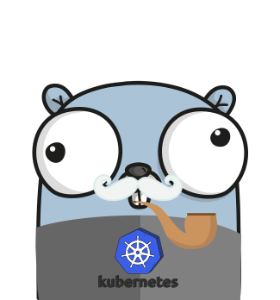

# Inspector

[](https://pkg.go.dev/github.com/qba73/inspector)

[](https://goreportcard.com/report/github.com/qba73/inspector)

[](https://github.com/qba73/inspector/actions/workflows/test.yml)
[](https://www.bestpractices.dev/projects/8889)
[](https://github.com/qba73/inspector/actions/workflows/scorecard.yml)



Before using `inspector` you need to have [kubectl](https://kubernetes.io/docs/tasks/tools/) binary installed and configured (config file `${HOME}/.kube/config`).

`inspector` is a CLI tool and a [Kubernetes plugin](https://kubernetes.io/docs/tasks/extend-kubectl/kubectl-plugins/) for running Cluster and Ingress Conroller diagnostics, collecting Cluster and Ingress Controller logs and generating reports.

## How to install `inspector`

### How to install it and use as a CLI tool

1) Install Go binary

   ```shell
   go install github.com/qba73/inspector/cmd/inspector@latest
   ```

1) Get help:

   ```shell
   inspector -h
   ```

   ```shell
   Usage:

      inspector [-v] [-h] [-n] <namespace>

   Collect K8s and NIC diagnostics in the given namespace

   In verbose mode (-v), prints out progess, steps and all data points to stdout.
   ```

1) Collect data points from `default` namespace

   ```shell
   inspector -n default > default.json
   ```

1) Collect data points from `nginx-ingress` namespace

   ```shell
   inspector -n nginx-ingress > nginx-ingress.json
   ```

### How to install it and use as a `kubectl` plugin

1) Clone the repo.
1) Build inspector.

   ```shell
   go build -o kubectl-inspector ./cmd/inspector/main.go
   ```

1) Copy the binary to a dir in your `$HOME`, for example:

   ```shell
   cp kubectl-inspector /usr/local/bin/
   ```

1) Verify if the `kubectl` discovers the plugin:

   ```shell
   kubectl plugin list
   ```

   ```shell
   [...]
   /usr/local/bin/kubectl-inspector
   ```

1) Verify `inspector` can be run using `kubectl`:

   ```shell
   kubectl inspector -h

   Usage:

      inspector [-h] [-v] [-n] namespace

   Collect K8s and Ingress Controller diagnostics in the given namespace.

   In verbose mode (-v), prints out progess, steps and all data points to stdout.
   ```

1) Collect data points from `default` namespace

   Note that `inspector`'s default namespace is `default`.

   ```shell
   kubectl inspector > default.json
   ```

1) Collect data points from `nginx-ingress` namespace

   ```shell
   kubectl inspector -n nginx-ingress > nginx-ingress.json
   ```

## How it works

The program collects K8s cluster and [NGINX Ingress Controller](https://kubernetes.io/docs/concepts/services-networking/ingress/) diagnostics data. It prints out data in the JSON format to the stdout. This allows the output to be piped to other tools (for example [jq](https://jqlang.github.io/jq/)) for further parsing and processing.

## Collected data points

Currently `inspector` collects following data points:

- K8s version
- K8s cluster id
- Number of nodes in the cluster
- K8s platform name
- Pods
- Logs from pods
- Events
- ConfigMaps
- Services
- Deployments
- StatefulSets
- ReplicaSets
- Leases
- CRDs
- IngressClasses
- Ingresses
- IngressAnnotations

Planned:

- Nodes metrics
- Ingress Controller stats, options and configuration

Future releases will add support for collecting [K8s Gateway API](https://kubernetes.io/docs/concepts/services-networking/gateway/) diagnostics.

## Contributing

If you'd like to contribute to **Inspector**, please read the [Contributing guide](CONTRIBUTING.md).

Gopher image by [Gopherize.me](https://gopherize.me)
